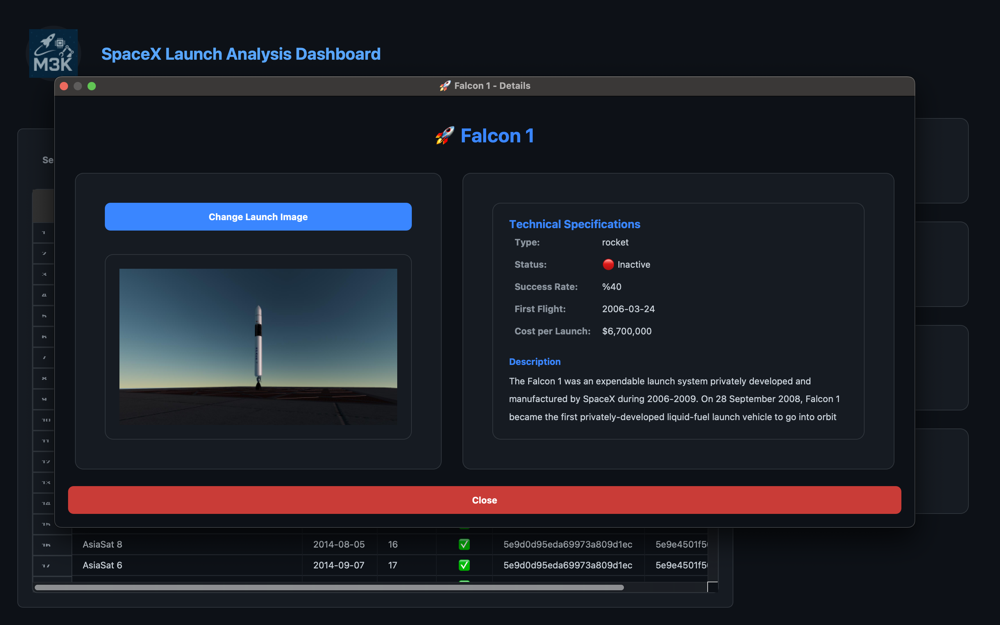

# SpaceX Launch Data Analysis Dashboard

This project is an interactive desktop application developed with PyQt5 for analyzing and visualizing SpaceX launch data. It allows users to explore launch data, create charts, and examine rocket galleries.

## Dashboard Screenshots

### Main Dashboard View

*Main dashboard screen - Launch data table, statistics cards, and filtering options*

### Charts and Analysis

*Charts tab - Launch counts by year, success rates, and interactive charts*

### Rocket Gallery

*Rocket gallery - Detailed information and images of SpaceX rockets*

## Features

- **Interactive Dashboard**: Modern and user-friendly "Space Blue" themed interface.
- **Data Table**: A filterable and sortable table containing all launch data.
- **Launch Details**: Double-click any launch to access detailed information about the rocket used in that mission (technical specifications, images).
- **Statistical Analysis**:
    - Total number of launches
    - Number of successful launches
    - Overall success rate
    - Year of first launch
- **Graphical Visualization**:
    - Launch counts by year
    - Successful/Failed launch distribution
    - Success rate chart by year
- **Rocket Gallery**: A gallery containing images and technical information of rockets used by SpaceX (Falcon 1, Falcon 9, Falcon Heavy).
- **Personalization**:
    - Ability to set a custom image as application logo.
    - Default image assignment when rocket image is not found.
- **Organized Project Structure**: Modular and organized folder structure for data, scripts, and asset files.

## Installation

To run the project on your local machine, follow these steps:

### 1. Clone the Project

```bash
git clone https://github.com/MEK-0/SpaceX-launch-Dashboard.git
cd SpaceX-launch-Dashboard
```

### 2. Create Virtual Environment (Recommended)

```bash
python -m venv venv
source venv/bin/activate  # For Windows: venv\Scripts\activate
```

### 3. Install Dependencies

While in the project root directory, install all required libraries using the `requirements.txt` file:

```bash
pip install -r requirements.txt
```

### 4. Create Data Files

Before running the application, you need to run the scripts in the `scripts` folder to create the necessary data files.

First, download launch data in `.csv` format:
```bash
python scripts/CsvConvert.py
```

Then, download rocket information and images:
```bash
python scripts/rocket_analysis.py
python scripts/download_rocket_images.py
```

## Running the Application

After completing all installation steps, you can run the main application with the following command:

```bash
python main.py
```

## Project Structure

The project has an organized folder structure as follows:

```
.
├── main.py                 # Main PyQt5 application
├── requirements.txt        # Required libraries
├── README.md               # This file
├── data/                   # .csv and .json data files
│   ├── spacex_launches.csv
│   └── rockets_info.json
├── assets/                 # Logo, icons, and downloaded images
│   ├── M3k.jpg
│   └── images/
│       └── ...
└── scripts/                # Helper Python scripts
    ├── CsvConvert.py
    ├── rocket_analysis.py
    └── download_rocket_images.py
```

## Contributing

Your contributions help us improve the project further! Please don't hesitate to send pull requests or open issues.

1. Fork the project.
2. Create a new branch (`git checkout -b feature/NewFeature`).
3. Commit your changes (`git commit -am 'New feature added'`).
4. Push your branch (`git push origin feature/NewFeature`).
5. Create a Pull Request.

## License

This project is licensed under the MIT License. See the `LICENSE` file for more details. 
